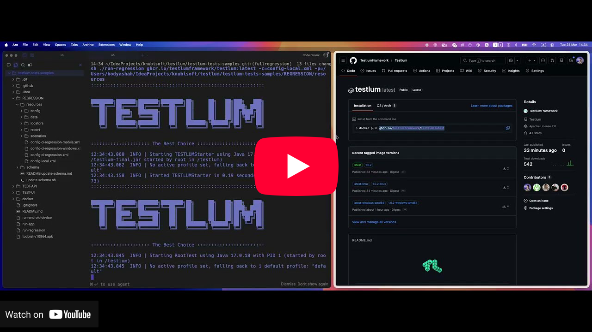

# Testlum DEMO APP

## Testlum Image Status

<!-- RESULTS-TABLE:START -->
| Image | Linux `amd64` | Linux `arm64` | Windows `amd64` | Branch | Last Updated | Mobile Tests |
|---|---|---|---|---|---|---|
| [`latest`](https://github.com/orgs/TestlumFramework/packages/container/package/testlum) | [❌](https://github.com/TestlumFramework/Demo/actions/runs/24955922673) | [✅](https://github.com/TestlumFramework/Demo/actions/runs/24955922673) | [✅](https://github.com/TestlumFramework/Demo/actions/runs/24955922673) | [`main`](https://github.com/TestlumFramework/Demo/tree/main) | 2026/04/23 | ✅ |
| [`1.0.2`](https://github.com/orgs/TestlumFramework/packages/container/package/testlum) | [❌](https://github.com/TestlumFramework/Demo/actions/runs/24955922673) | [❌](https://github.com/TestlumFramework/Demo/actions/runs/24955922673) | [✅](https://github.com/TestlumFramework/Demo/actions/runs/24955922673) | [`v1.0.2`](https://github.com/TestlumFramework/Demo/tree/v1.0.2) | 2026/04/14 | ➖ |
| [`1.1.0`](https://github.com/orgs/TestlumFramework/packages/container/package/testlum) | [✅](https://github.com/TestlumFramework/Demo/actions/runs/24955922673) | [✅](https://github.com/TestlumFramework/Demo/actions/runs/24955922673) | [✅](https://github.com/TestlumFramework/Demo/actions/runs/24955922673) | [`main`](https://github.com/TestlumFramework/Demo/tree/main) | 2026/04/23 | ➖ |
<!-- RESULTS-TABLE:END -->

A comprehensive end-to-end testing application that serves as both a test target and a validation suite for the [Testlum](https://github.com/TestlumFramework/Testlum) testing framework.

## 🎬 How to Run Regression Tests with Testlum

Learn how to execute existing regression tests using the Testlum framework and the demo repository.

⚠️ To see the browser during web test execution, make sure headless mode is disabled.

By default, tests may run in headless mode (without opening a browser window).  
If you want to observe the UI and test flow visually, update your configuration to turn off headless mode before running the tests [here](REGRESSION/resources/config/local/vault/ui.xml)
and visit http://localhost:7900 by providing `secret` as a password

[](https://www.youtube.com/watch?v=WOaw2a2kQt0)

## Overview

The project consists of three main components:

- **TEST-API** — Spring Boot backend exposing REST, GraphQL, and WebSocket endpoints across multiple integrations
- **TEST-UI** — Vue 3 frontend dashboard used as a target for UI automation tests
- **REGRESSION** — Testlum-based test suite covering all supported integration types

## Tech Stack

| Layer | Technologies |
|---|---|
| Frontend | Vue 3, Vite, TypeScript, Tailwind CSS, CoreUI |
| Backend | Spring Boot 2.5.4, Spring Security, Spring Data |
| Databases | PostgreSQL, MySQL, Oracle, ClickHouse, MongoDB, DynamoDB |
| Caching | Redis |
| Message Queues | Kafka, RabbitMQ, AWS SQS |
| Cloud | AWS (Lambda, S3, DynamoDB, SQS, SES) via LocalStack |
| APIs | REST, GraphQL, WebSocket |
| Testing | Testlum Framework, Selenium Grid |
| Infrastructure | Docker, Docker Compose, HashiCorp Vault |
| Authentication | JWT, Basic Auth |

## Prerequisites

- Docker and Docker Compose
- (Optional) Android emulator for mobile testing

## Running the Application

A single script orchestrates the full stack:

```bash
./run-app
```

This will:
1. Validate Docker is installed and running
2. Create the `e2e_network` Docker network
3. Start all integration services (databases, queues, cloud emulators)
4. Initialize HashiCorp Vault
5. Start Selenium Grid
6. Build and start TEST-API and TEST-UI

To also launch the Android emulator for mobile testing:

```bash
./run-app --mobile
# or
./run-app -m
```

## Project Structure

```
mega-test-app/
├── TEST-API/          # Spring Boot backend
├── TEST-UI/           # Vue 3 frontend
├── REGRESSION/        # Testlum test suite
│   └── resources/
│       ├── scenarios/ # Test scenario definitions (XML)
│       ├── locators/  # UI element locators
│       ├── data/      # Test data (JSON)
│       └── config/    # Execution configurations
├── docker/            # Docker Compose files and init scripts
├── run-app            # Main orchestration script
└── run-android-device # Android emulator setup
```

## Test Coverage

The REGRESSION suite covers:

- **HTTP** — REST APIs, Basic Auth, JWT, GraphQL, WebSocket, multipart uploads
- **Databases** — MySQL, PostgreSQL, Oracle, ClickHouse, MongoDB, DynamoDB
- **Message Queues** — Kafka, RabbitMQ, SQS
- **Storage** — Redis, S3
- **UI** — Web browser, mobile browser, native Android
- **Mail** — SendGrid, SES, SMTP, Twilio
- **Shell** — Shell command execution
- **Core** — Conditions, assertions, variables, data variations

## Integration Services

The following services are started via Docker Compose:

| Service | Purpose |
|---|---|
| PostgreSQL (×2) | Relational DB and auth DB |
| MySQL | Relational DB |
| Oracle XE 18.4 | Relational DB |
| MongoDB 4.2 | Document store |
| Elasticsearch 7.12 | Search engine |
| ClickHouse | Analytics DB |
| Redis 7 | Cache / key-value store |
| DynamoDB Local | AWS DynamoDB emulator |
| Kafka | Message streaming |
| RabbitMQ 3.6 | Message broker |
| LocalStack | AWS services (Lambda, S3, SQS, SES) |
| HashiCorp Vault | Secrets management |
| Selenium Grid | Distributed browser automation |

## Running Tests

Test execution is configured via XML files in `REGRESSION/resources/config/`:

- `config-local.xml` — Local development execution
- `config-ci-regression.xml` — CI pipeline execution
- `config-ci-regression-mobile.xml` — Mobile CI execution

### run-regression script

The `run-regression` script runs the Testlum Docker container against the local test resources.

**Usage:**
```bash
./run-regression
```

By default it uses the pre-defined values:
- **Image**: `ghcr.io/testlumframework/testlum`
- **Config**: `-c=config-local.xml`
- **Path**: `-p=<project-root>/REGRESSION/resources`

To use dynamic arguments, edit the script and switch to the commented-out dynamic params section, then call:
```bash
./run-regression <image-name> -c=<config>.xml -p=<path-to-resources>
```

**Arguments:**

| # | Argument | Format | Description |
|---|---|---|---|
| 1 | Docker image name | `<image>:<tag>` | Testlum Docker image to run |
| 2 | Config file | `-c=<file>.xml` or `--config=<file>.xml` | Test configuration file |
| 3 | Path to resources | `-p=<path>` or `--path=<path>` | Path to the `REGRESSION/resources` directory |

**Example:**
```bash
./run-regression testlum:1.0.2 -c=config-local.xml -p=/home/user/mega-test-app/REGRESSION/resources
```

The script validates that Docker is running, all arguments are in the correct format, and the specified resources path exists before launching the container.

## Building Individually

**Backend (TEST-API)**:
```bash
cd TEST-API
mvn clean package
```

**Frontend (TEST-UI)**:
```bash
cd TEST-UI
pnpm install
pnpm dev      # development server
pnpm build    # production build
```
